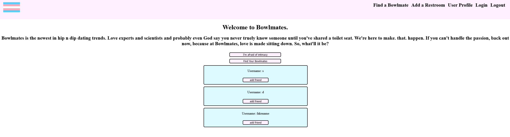
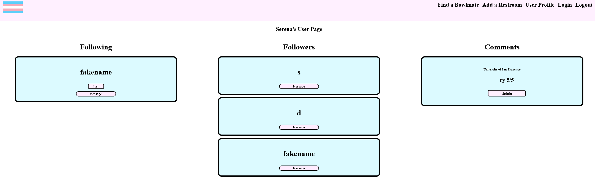
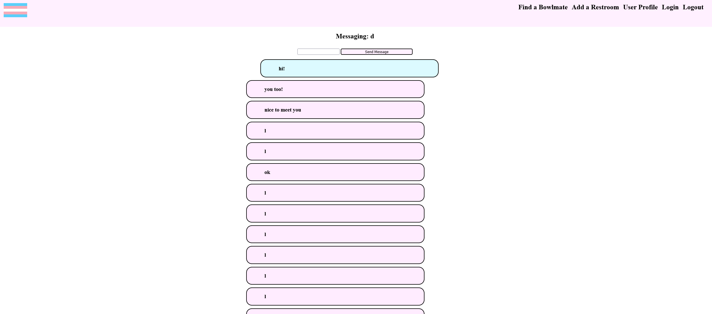

# Trans restroom finder/Bowlmates

## Summary

A webapp designed to allow users to search for and rank transgender accessible restrooms.

## Built With

-Flask

-HTML5

-CSS

-SQLaclhemy

-Python

-Javascript

-React

-Refugee Restroom API

## Visual Walkthrough
The homepage displays restrooms based on searched for city, with an option to make sure restrooms are ADA accessible

If a user wants to leave comments, they must create an account and log in, which they do so on this page

Once logging in, users can leave comments, which can be shown by clicking the show comments button

Users can also add individual restrooms if they want

On the Bowlmates homepage, Users can follow people who they have commented on the same restroom as

Comments you've left, as well as people you follow, will show up on your user profile

Users can message each other if they've added them

## My Links

[Github](https://github.com/SerenaChandler)

[Linkedin](https://www.linkedin.com/in/serena-chandler/)