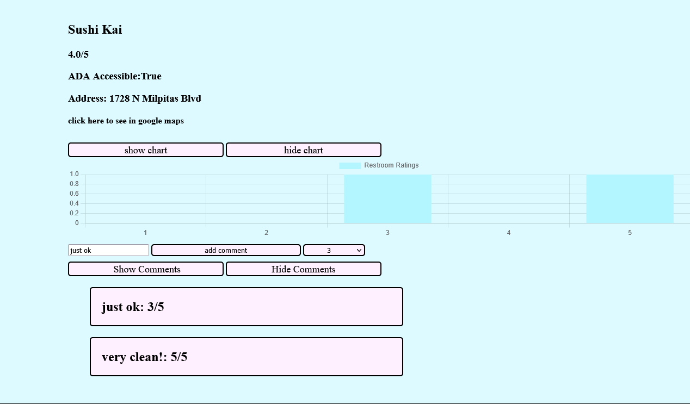

# Trans restroom finder/Bowlmates

## Summary

A webapp designed to allow users to search for and rank transgender accessible restrooms.

## Built With

-Flask

-Python

-Javascript

-React

## Visual Walkthrough
The homepage displays restrooms based on searched for city, with an option to make sure restrooms are ADA accessible


If a user wants to leave comments, they must create an account and log in, which they do so on this page


Once logging in, users can leave comments, which can be shown by clicking the show comments button



Users can also add individual restrooms if they want


## Code Snippets


React was used to display the Bowlmates page
```
function App() {
  const [matchesData, setMatchesData] = React.useState([]);
  const [displayMatches, setDisplayMatches] = React.useState([]);

  function MatchCard(props) {
    return (
      <div className="match">
        <p>Username: {props.username}</p>
        <form action="/add-friend">
          <input className="button" type="submit" id={props.id} value={'add friend'} onClick={addFriend}/>
        </form>
      </div>
    );
  }

  function addFriend(evt) {
    evt.preventDefault()
    const formInputs = {
      id: evt.target['id'],
    };
    console.log(evt.target['id']);
    fetch(`/add-friend`, {
      method: "POST",
      body: JSON.stringify(formInputs),
      headers: {
        "Content-Type": "application/json",
      },
    })
      .then((res) => res.json())
      .then(data => alert(data.status))
  }

  function MatchContainer() {
    return <div className="matchBox">{displayMatches}</div>;
  }

  React.useEffect(() => {
    fetch("/find-pals")
      .then((res) => res.json())
      .then((data) => {
        console.log(data);
        setMatchesData(data);
      });
  }, []);

  function showMatches() {
    const matchList = [];
    for (let match of matchesData) {
      matchList.push(
        <MatchCard key={match.id} username={match.username} id={match.id} />
      );
    }
    setDisplayMatches(matchList);
  }

```

Leaving new comments was handled with vanilla JavaScript
```
function leaveComment(evt) {
  evt.preventDefault();
  console.log(evt.target);
  const restroom_id = evt.target.children[0].value;
  const current_rating = evt.target.children;
  const text = evt.target.children[1].value;
  const formInputs = {
    rating: evt.target.children[3].value,
    text: evt.target.children[1].value,
  };
  if (text != "") {
    fetch(`/comment/${restroom_id}`, {
      method: "POST",
      body: JSON.stringify(formInputs),
      headers: {
        "Content-Type": "application/json",
      },
    })
      .then((res) => res.json())
      .then((resj) => {
        if (
          document.querySelector(`#comment-list${restroom_id}`).innerHTML !== ""
        ) {
          showComments(evt);
        }
        document.querySelector("#comment-success").innerHTML = resj.status;
        document.querySelector(
          `#rating${resj.restroom_id}`
        ).innerHTML = `${resj.rating}/5`;
      });
  } else {
    alert("please enter a comment before submitting rating");
  }
}
```


## My Links

[Github](https://github.com/SerenaChandler)

[Linkedin](https://www.linkedin.com/in/serena-chandler/)